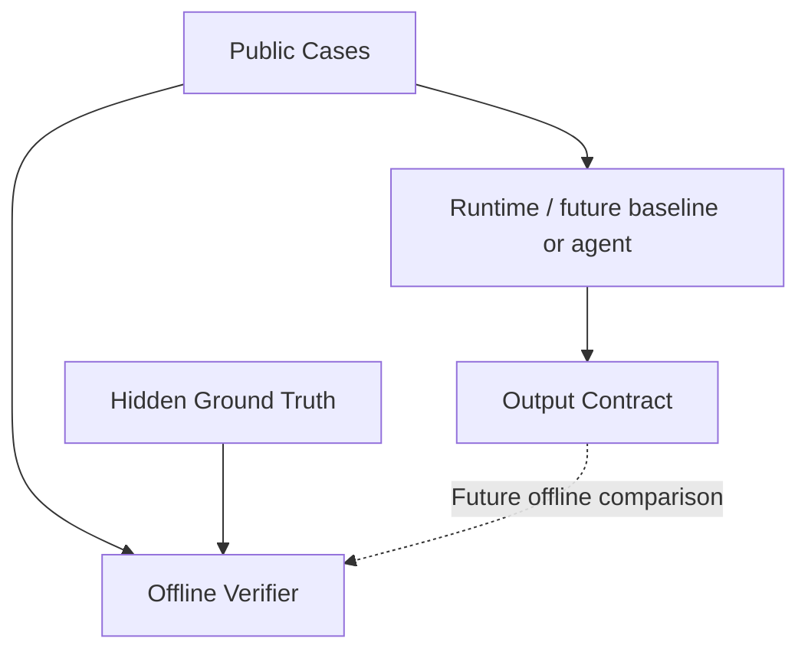

# System Architecture

## Overview
The project is a benchmark and validation pipeline in Phase 1. Docker defines separate runtime and verifier targets. The runtime uses an explicit COPY allowlist and excludes ground truth, evaluator code, tests, evidence, and reports. The verifier contains the frozen answer key and validation tools.

## Components
1. **Verification Scripts:** `verify.ps1` and `verify.sh`. They orchestrate the environment checks, Docker build, and test runs.
2. **Phase 1 Data Generator:** `scripts/generate_phase1_data.py` generates 6 synthetic cases into `data/cases/public/` and `data/cases/ground_truth/`.
3. **Phase 1 Validator:** `scripts/validate_phase1.py` validates schemas, case counts, leakage constraints, synthetic-data constraints, and the deterministic ground-truth oracle.
4. **Manifest Verifier:** `scripts/verify_manifest.py` checks `evidence/phase_1/SHA256_MANIFEST.txt` to ensure the benchmark is frozen and untampered.
5. **Security Scanner:** `scripts/verify_container_security.sh` checks inside the container to ensure no secrets or ground-truth artifacts are leaked.

## Data Flow

## Agent Architecture
Architecture status: NOT VERIFIED (Phase 2+ is locked).

## Integrations
- Docker Engine for containerized execution.
- No LLM integration exists in Phase 1. Gemini is only a conditional provider decision for a later approved phase.

## Unknowns
- Exact LLM provider and agent framework for Phase 4.
