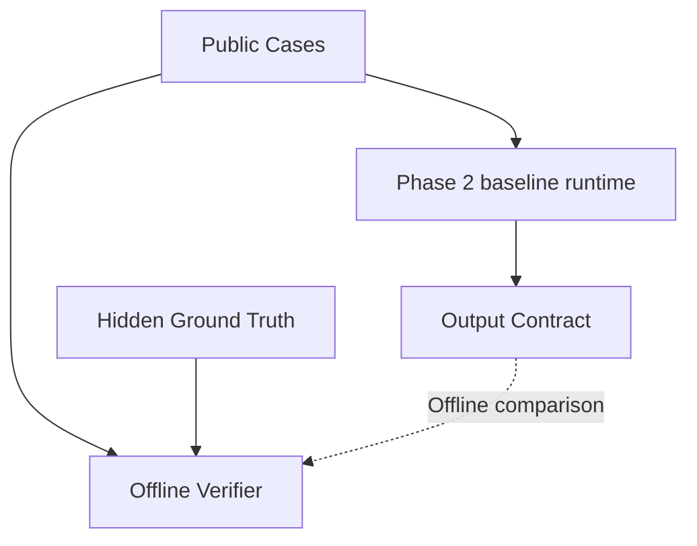

# System Architecture

## Overview
Phase 1 benchmark design is externally approved and Phase 2 Fair Baseline is ready for external review. Docker defines separate runtime and verifier targets. The runtime uses an explicit COPY allowlist and excludes ground truth, evaluator code, tests, evidence, and reports. The verifier contains the frozen answer key and validation tools.

## Components
1. **Verification Scripts:** `verify.ps1` and `verify.sh`. They orchestrate the environment checks, Docker build, and test runs.
2. **Phase 1 Data Generator:** `scripts/generate_phase1_data.py` generates 6 synthetic cases into `data/cases/public/` and `data/cases/ground_truth/`.
3. **Phase 1 Validator:** `scripts/validate_phase1.py` validates schemas, case counts, leakage constraints, synthetic-data constraints, and the deterministic ground-truth oracle.
4. **Manifest Verifier:** `scripts/verify_manifest.py` checks `evidence/phase_1/SHA256_MANIFEST.txt` to ensure the benchmark is frozen and untampered.
5. **Security Scanner:** `scripts/verify_container_security.sh` checks inside the container to ensure no secrets or ground-truth artifacts are leaked.

## Data Flow

## Agent Architecture
The Phase 2 baseline is intentionally one pinned `gemini-3.6-flash` call per case, without agent tools. Its accepted six-case run and clean-clone gate are verified. Phase 3+ architecture remains locked.

## Integrations
- Docker Engine for containerized execution.
- Gemini is the selected Phase 2 provider. Two provider failures and one nonportable v1 run are preserved as superseded evidence. The accepted v2 run uses canonical text hashes and has a VALID report.

## Unknowns
- Exact LLM provider and agent framework for Phase 4.
